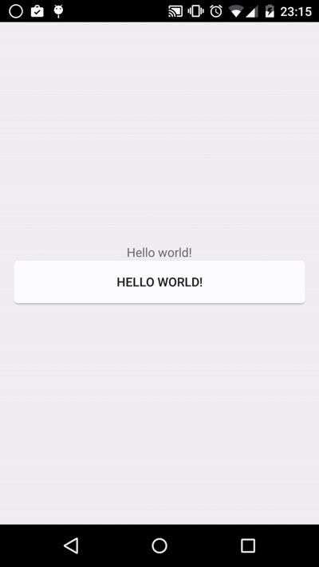

# ANDROID5.0系统开发问题以及新特性 #
 

## 系统通知栏图标白板，通知栏图标不全 ##
android5.0以上系统（不包含5.0），系统默认通知栏图标为系统启动图标，会自动将通知栏的图标（有色区域）全部填充为白色，像一个白色格子，这是Google 为了实现材料设计规范，特意为之。

如下图，前2个icon有颜色，后面几个都是白色的。

### 通知栏白色解决办法 ###
通过代码设置通知栏图标

    .setSmallIcon(icon)

然后为了去除白色图标，镂空背景即可：
所以这之后的想要设置显示状态栏icon不为白色：这个icon只要背景需要透明，只让内容块纯白色
指定最顶层状态栏的小图标大小（60*60到80*80像素为佳）

 

### 通知栏白色解决办法 ###
刷新通知的时候，需要刷新通知图标

    contentView.setImageViewResource(R.id.image_tips,context.getApplicationInfo().icon);

代码如下：

    @Override
    public void onDownloadSize(long offsize, long size, String speed) {
        try {
            contentView.setTextViewText(R.id.name, ToolUtils.getAppname(context));
            contentView.setImageViewResource(R.id.image_tips,context.getApplicationInfo().icon);
            contentView.setTextViewText(R.id.tv_progress, ToolUtils.getSize(offsize) + "/" + ToolUtils.getSize(size));
            contentView.setProgressBar(R.id.progressbar, (int) size, (int) offsize, false);
            builder.setOngoing(true);
            Notification notification = builder.build();

            mNotificationManager.notify(NOTIFY_ID, notification);
        } catch (Exception e) {
            e.printStackTrace();
        }
    }

## 新增控件CardView ##

### 使用方法   ###

5.0新增控件CardView。

在Android Studio中进行使用，我们需要只需要在Gradle中添加CardView包的依赖即可进行使用。

    compile 'com.android.support:cardview-v7:21.0.+'  

### 控件基本介绍 ###
    public class CardView extends FrameLayout implements CardViewDelegate {  
    ...  
    }  
从源码看，CardView继承FrameLayout，所以CardView是一个ViewGroup，我们可以在里面添加一些控件进行布局。既然CardView继承FrameLayout，而且Android中早已有了FrameLayout布局，为什么还有使用CardView这个布局控件呢？

这个FrameLayout特殊点就是有rounded corner（圆角）和shadow（阴影），这个就是它的特殊之处，回首往日，我们需要自定义shape文件进行实现圆角和阴影的设计，现在google的大牛已经把它设计为CardView的属性供我们设置进行使用。下面我们看看CardView新增了哪些属性：

- CardView_cardBackgroundColor 设置背景色
- CardView_cardCornerRadius 设置圆角大小
- CardView_cardElevation 设置z轴阴影
- CardView_cardMaxElevation 设置z轴最大高度值
- CardView_cardUseCompatPadding 是否使用CompadPadding
- CardView_cardPreventCornerOverlap 是否使用PreventCornerOverlap
- CardView_contentPadding 内容的padding
- CardView_contentPaddingLeft 内容的左padding
- CardView_contentPaddingTop 内容的上padding
- CardView_contentPaddingRight 内容的右padding
- CardView_contentPaddingBottom 内容的底padding

## 新增控件RecyclerView##

RecyclerView是ListView的替代品，谷歌推荐使用RecyclerView替代ListView。 

RecyclerView提供比ListView更加灵活的使用，并且性能比ListView更优。 

RecyclerView可以设置线性，网格，瀑布流式三种布局管理器。 

- LinearLayoutManager（线性布局管理器） 

- GridLayoutManager（网格布局管理器） 

- StaggeredGridLayoutManager（瀑布流式布局管理器）

###开源项目###

GitHub上的这个开源项目可以帮助解决一些问题，例如添加divider、点击事件等等，但还远远不够。

CardView的多状态背景色问题，暂时没有解决，[参考链接](http://stackoverflow.com/questions/25352930/cardview-background-color-states-not-being-respected)；

###下拉刷新###

可使用android原生的SwipeRefreshLayout解决；

###上拉翻页###

1. 使用SwipeRefreshLayout； 

2. 自己监听事件实现Endless效果；

###HeaderView###
RecyclerView没有像ListView那样提供addHeaderView()方法，要实现类似效果，有两种方法：

- 将第一个item作为header，使用android-parallax-recyclerview这个库； 

- 让第一个item完全透明，下层显示一个同高的view作为header，使用ASOV这个库。

## 扁平化设计风格（Material Design） ##

谷歌希望能够让Material Design给用户带来纸张化的体验。新的视觉语言，在基本元素的处理上，借鉴了传统的印刷设计，字体版式、网格系统、空间、比例、配色、图像使用等这些基础的平面设计规范。

其实在GitHub上已经有不少第三方的实现，值得一提的是，这个名为MaterialDesignCenter的项目把大量相关项目汇总在了一起供开发者参考，值得一看。以下列出我认为值得使用的第三方实现：

FAB: [FloatingActionButton](https://github.com/makovkastar/FloatingActionButton)

对话框: [material-dialogs](https://github.com/afollestad/material-dialogs)

各类UI控件: [MaterialDesignLibrary](https://github.com/navasmdc/MaterialDesignLibrary)

另外几个汇集了android上各类交互效果的项目[Interactive-animation](https://github.com/Rano1/Interactive-animation)、[awesome-android-ui](https://github.com/wasabeef/awesome-android-ui)、[android-open-project](https://github.com/Trinea/android-open-project)（300+项目，不仅限于MD），同样值得参考。

## SlidingTabLayout的tab导航 ##

v7包的Actionbar对象里，与navigation有关的方法（例如setNavigationMode）都不建议使用了，应使用googleio2014提供的SlidingTabLayout实现类似功能。

[参考链接1](https://stackoverflow.com/questions/26540078/use-tab-with-new-toolbar-appcompat-v7-21)，[参考链接2](http://blog.csdn.net/mr_wanggang/article/details/42340265)

## .9图片在android studio中异常 ##

    Error:Execution failed for task’:app:mergeDebugResources’. 
    Crunching Cruncher image.9.png failed, see logs 

### 原因 ###
.9图片不标准，在eclipse没有Android studio中严格被检测出错
### 解决 ###
用android studio 打开.9图片重新画线

## android 5.0之后toolbar阴影 ##
activity中添加代码 getSupportActionBar().setElevation(0);

##新的摄像头API##
来Google本次Android版本更新对Camera这块新出了替代类android.hardware.camera2。

这个类把Camera设备封装成多级(包含多个处理阶段)的线性管道，这个管道用来处理输入请求中捕获的每个帧。通过camera2向系统请求拍照时，会返回一个带有一套图像缓冲的输出数据包。如果多个请求的会按顺序处理，多次重复请求只发一次。

###使用新API：###

- 获取CameraManager实例就可以遍历，查询和打开一个Camera对象。

- 通过cameraManager对象调研getCameraCharacteristics(String)来获得CameraCharacteristics对象，该对象包含设备的设置信息和输出参数。

- 通过CameraCaptureSession对象为每个预览对象进行预设置，如大小和format（这些格式必须是设备支持的），可以调用camera.createCaptureSession(List, CameraCaptureSession.StateCallback, Handler)就可获得此对象。

- 创建SurfaceView orTextureView (via its SurfaceTexture).  渲染图像。系统底层或调用RenderScript或OpenGles，甚至native本地方法来实例传给view的数据。

- 构造一个CaptureRequest对象，来描述每次捕获图片的具体设置。

- 最终调用capture()方法完成图像的捕获。

##RippleDrawable（波纹图）##
RippleDrawable顾名思义是波纹图，只能在Android5.0以上使用，目前还没有提供RippleDrawable向下兼容的支持包。
 
RippleDrawable可显示一个涟漪效应响应状态变化 。  
###效果图###
 
###使用方法###

####定义一个背景的xml####

ripple_bg.xml:

    <?xml version="1.0" encoding="utf-8"?>
    <ripple xmlns:android="http://schemas.android.com/apk/res/android"
      android:color="#FF21272B">
      <item>
   		 <shape android:shape="rectangle">
      		<solid android:color="#FFFFFF" />
     	    <corners android:radius="4dp" />
    	</shape>
      </item>
      <item android:drawable="@drawable/rounded_corners" />
    </ripple>
    
其中<ripple android:color="#FF21272B" .... />这个是指定水波纹的颜色.

而<item />里面的东西,我们都很熟悉,就是普通的定义一个带圆角的背景.

####这是Activity的布局xml####

activity_main.xml
    
    <LinearLayout xmlns:android="http://schemas.android.com/apk/res/android"
      xmlns:tools="http://schemas.android.com/tools"
      android:layout_width="match_parent"
      android:layout_height="match_parent"
      android:gravity="center"
      android:orientation="vertical"
      android:paddingBottom="@dimen/activity_vertical_margin"
      android:paddingLeft="@dimen/activity_horizontal_margin"
      android:paddingRight="@dimen/activity_horizontal_margin"
      android:paddingTop="@dimen/activity_vertical_margin"
      tools:context=".MainActivity">
      <TextView
	    android:layout_width="wrap_content"
	    android:layout_height="wrap_content"
	    android:text="@string/hello_world" />
      <Button
	    android:layout_width="match_parent"
	    android:layout_height="wrap_content"
	    android:background="@drawable/ripple_bg"
	    android:text="@string/hello_world" />
    </LinearLayout>

#6.0系统可能出现的问题汇总#

Android 6.0（API 23）

##权限问题##

android的权限系统一直是首要的安全概念，因为这些权限只在安装的时候被询问一次。一旦安装了，后面就不再询问。android 6.0 之后，系统不会在软件安装的时候就赋予该app所有其申请的权限，对于一些危险级别的权限，app需要在运行时一个一个询问用户授予权限。

###旧版本app兼容问题##

那么问题来了？是不是所有以前发布的app都会出现问题呢？答案是不会，只有那些targetSdkVersion 设置为23和23以上的应用才会出现异常。

所以targetSdkVersion如果没有设置为23版本或者以上，系统还是会使用旧规则：在安装的时候赋予该app所申请的所有权限。所以app当然可以和以前一样正常使用了。

但是还有一点需要注意的是6.0的系统里面，用户可以手动将该app的权限关闭。

那么问题又来了，如果以前的老应用申请的权限被用户手动关闭了怎么办，应用会崩溃么？

经过测试发现，不会抛出异常，不会崩溃，只不过调用那些被用户禁止权限的api接口返回值都为null或者0，所以我们只需要做一下判空操作就可以了，不判空当然还是会崩溃的喽。

[点击查看详细解决方案](http://blog.csdn.net/hudashi/article/details/50775180)

###权限分类###
系统权限，分为normal和dangerous类型。

- **normal：**这个权限类型并不直接威胁到用户的隐私，可以直接在manifest清单里注册，系统会帮我们默认授权的。

- **dangerous：**这个可以直接给app访问用户一些敏感的数据，不仅需要在manifest清单里注册，同时在使用的时候，需要向系统请求授权。
 
**注意：**在dangerous中还需要注意一点，SYSTEM_ALERT_WINDOW 和 WRITE_SETTINGS这两个特殊授权请求方式，跟一般授权请求方式不同。

[点击查看系统权限分类的详细介绍](http://www.cnblogs.com/cr330326/p/5181283.html)

##删除HttpClient的相关类##
###解决方案###
在相应的module下的build.gradle中加入：

    android {
    	useLibrary 'org.apache.http.legacy'
    }

注意放置的位置：是在android {}中
